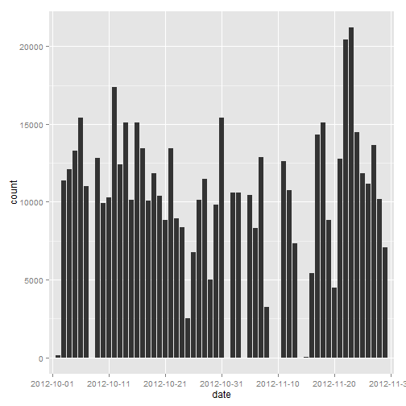
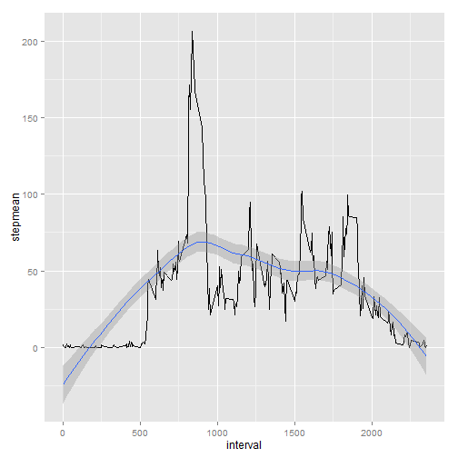
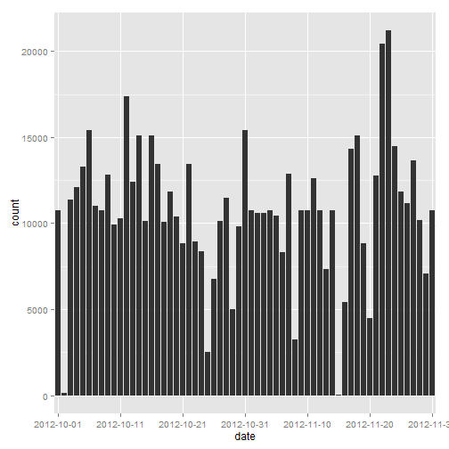
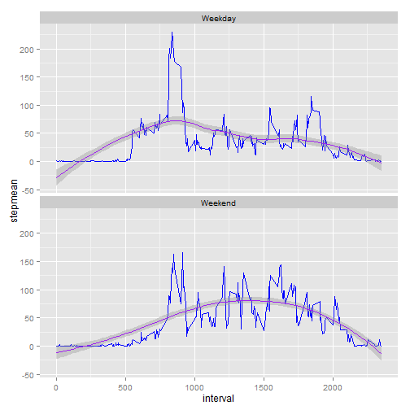

## Introduction
This document contains a series of five chunks of R code which provide an analysis of user step activity recorded over time.

1. Data Loading and Preprocessing
2. Exploratory analysis of mean and median steps per day
3. Exploratory analysis of daily activity patterns
4. Data Correction to impute missing step values
5. Exploratory analysis of workday activity patterns vs. weekend activity patterns

### Required R Packages
- dplyr 0.4.1
- ggplot2 1.0.1
- lubridate 1.3.3


```r
library(dplyr)
library(ggplot2)
library(lubridate)
```

## Loading and preprocessing the data
1. Set the working directory path
2. Download the compressed activity data
3. Decompress the data
4. Load the data into a dplyr tbl_df
5. Sumarize the raw data

Based on the summary, we can see that there are 3 fields in this data set; steps, date, interval. These fields are described in the course assignment.  


```r
setwd("~/data/RepData/RepData_PeerAssessment1")
unzip("activity.zip")
activity <- tbl_df(read.csv("activity.csv"))
summary(activity)
```

```
##      steps                date          interval     
##  Min.   :  0.00   2012-10-01:  288   Min.   :   0.0  
##  1st Qu.:  0.00   2012-10-02:  288   1st Qu.: 588.8  
##  Median :  0.00   2012-10-03:  288   Median :1177.5  
##  Mean   : 37.38   2012-10-04:  288   Mean   :1177.5  
##  3rd Qu.: 12.00   2012-10-05:  288   3rd Qu.:1766.2  
##  Max.   :806.00   2012-10-06:  288   Max.   :2355.0  
##  NA's   :2304     (Other)   :15840
```

```r
### proportion of rows missing steps:
2304 / (2304 +15840)
```

```
## [1] 0.1269841
```

On cursory review, 2304 records (13%) are missing steps (NA).  

## What is the mean total number of steps taken per day?
Here, we use the dplyr package to quickly group activities by date, and then tally the steps per day. The "step per day" calculation is acheived via a dplyr pipeline construct:   
-group activity records by date,  
-summarise steps via sum, ignoring "NA" values.  

Next, plot the sum of steps per day in a historgram.  

Lastly, report the mean steps per day, and the median steps per day as part of standard summary statistics for the summarized data.  


```r
stepperday <- activity %>% 
        group_by(date) %>% 
        summarise(stepsum = sum(steps, na.rm = TRUE))

qplot(date, data=stepperday, weight=stepsum, geom="histogram") + 
        scale_x_discrete(
                breaks=stepperday$date[seq(1,dim(stepperday)[1],by=10)])
```

 

```r
summary(stepperday)
```

```
##          date       stepsum     
##  2012-10-01: 1   Min.   :    0  
##  2012-10-02: 1   1st Qu.: 6778  
##  2012-10-03: 1   Median :10395  
##  2012-10-04: 1   Mean   : 9354  
##  2012-10-05: 1   3rd Qu.:12811  
##  2012-10-06: 1   Max.   :21194  
##  (Other)   :55
```

## What is the average daily activity pattern?
The averge daily activity pattern is modelled as the average of steps across all days for each five minute activity pattern.


```r
meanpattern <- activity %>% group_by(interval) %>% 
                          summarise(stepmean = mean(steps, na.rm = TRUE))

qplot(interval, stepmean, data=meanpattern, geom=c("line","smooth"))
```

```
## geom_smooth: method="auto" and size of largest group is <1000, so using loess. Use 'method = x' to change the smoothing method.
```

 

```r
maxpattern <- meanpattern %>% filter(stepmean == max(meanpattern$stepmean))
maxpattern
```

```
## Source: local data frame [1 x 2]
## 
##   interval stepmean
## 1      835 206.1698
```

After calculating the average steps for each interval, we can see that a typical day has an morning activity spike.


## Imputing missing values
Here, we impute missing step values. After grouping the activity records by intervals, the replace function computes the mean steps for each interval as the replacement for each missing steps value.  

Once this computation has been completed, the imputed results are plotted and summarized for comparison to the original activity data.  


```r
### impute missing values as the mean steps within each interval
imputedactivity <- activity %>% 
                   group_by(interval) %>%
                   mutate(steps= replace(steps, 
                                         is.na(steps), 
                                         mean(steps, na.rm=TRUE)))

imputedstepperday <- imputedactivity %>% group_by(date) %>% summarise(stepsum = sum(steps, na.rm = TRUE))

### explore the imputed results
qplot(date, data=imputedstepperday, weight=stepsum, geom="histogram") + 
        scale_x_discrete(
                breaks=imputedstepperday$date[seq(1,
                                                  dim(imputedstepperday)[1],
                                                  by=10)]
                )
```

 

```r
summary(imputedstepperday)
```

```
##          date       stepsum     
##  2012-10-01: 1   Min.   :   41  
##  2012-10-02: 1   1st Qu.: 9819  
##  2012-10-03: 1   Median :10766  
##  2012-10-04: 1   Mean   :10766  
##  2012-10-05: 1   3rd Qu.:12811  
##  2012-10-06: 1   Max.   :21194  
##  (Other)   :55
```
Here, we see that imputing missing values increased the mean steps per day. This is normal.  

## Are there differences in activity patterns between weekdays and weekends?

By filtering the imputed activity into weekend vs. weekday subsets, we can see that activity across a weekend day is generally higher then the activity across a working week day.  

According the lubridate package functionality, Sundays are coded as "wday == 1"", while Saturdays are coded as "wday == 7".  

We split the imputed activities, seperating weekend days from work week days.  

Next, daily average activity patterns are computed for "work days" vs. "weekends".  

Finally, the new activity patterns are plotted for visual comparison.


```r
weekendactivity <- imputedactivity %>% 
  mutate(weekend = 
           ifelse(
             wday(ymd(date)) %in% c(1,7),
             "Weekend",
             "Weekday")
         )

weekendpattern <- weekendactivity %>% 
  group_by(weekend,interval) %>% 
  summarise(stepmean = mean(steps))

summary(weekendpattern)
```

```
##    weekend             interval         stepmean      
##  Length:576         Min.   :   0.0   Min.   :  0.000  
##  Class :character   1st Qu.: 588.8   1st Qu.:  2.047  
##  Mode  :character   Median :1177.5   Median : 28.133  
##                     Mean   :1177.5   Mean   : 38.988  
##                     3rd Qu.:1766.2   3rd Qu.: 61.263  
##                     Max.   :2355.0   Max.   :230.378
```

```r
ggplot(weekendpattern, aes(interval,stepmean)) +
  geom_line(color="blue") +
  stat_smooth(color="purple") +
  facet_wrap(~weekend,nrow=2)
```

```
## geom_smooth: method="auto" and size of largest group is <1000, so using loess. Use 'method = x' to change the smoothing method.
## geom_smooth: method="auto" and size of largest group is <1000, so using loess. Use 'method = x' to change the smoothing method.
```

 

## Summary
The exploratory analysis of the activity data set determined the following interesting facts:

1. The source data was missing step counts for roughly 13% of recorded observations.

2. On average, 9354 steps were taken per day, with a median of 10395 steps per day.

3. The average daily pattern of steps has an early stepmean spike of 206 steps at the 835 time interval.

4. Imputing missing values shifts the mean and median to 10766

5. Weekday daily activity patterns were compared to workday daily activity patterns. Weekend patterns show a higher level of activity spread across the entire day, whereas the weekday  pattern is similar to the average daily pattern presented in section 3.   

The weekday daily activity pattern is distinct from the weekend daily activity pattern.

